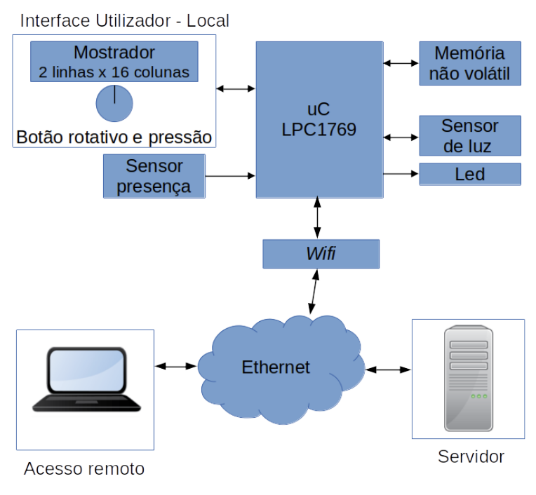

# Embedded Systems IoT Project – Ethernet Lighting Management (FreeRTOS)

## 🎯 Objective

This project was developed for the **Embedded Systems IoT (SEIoT)** course and aims to implement an **autonomous lighting management system** based on **motion detection** and **ambient light monitoring**.  

The system also supports:
- Sending data (current light level and motion detection logs) to a **cloud server**
- Remote configuration via **Ethernet/Wi-Fi**

The project is developed using the **FreeRTOS** kernel.

---

## 🛠️ Architecture

The system is built using the **NXP LPCXpresso LPC1769** development board and includes:

- 🧠 **Microcontroller**: LPC1769  
- 👀 **Motion Sensor**: AM312 (PIR-based)  
- 💡 **Light Sensor**: BH1750 (I2C interface)  
- 💾 **EEPROM**: 128 Kb non-volatile memory (SPI interface)  
- 🌐 **Wi-Fi Module**: ESP8266 (for MQTT communication and remote configuration)  
- 📟 **LCD Display**: MC1602C (2x16 characters) with HD44780 controller  
- 🕹️ **User Interface**: Rotary and push-button encoder  

---

## ⚙️ Operation

The system is FreeRTOS-based and supports two main modes of operation:

### ✅ Normal Mode

- Lights are automatically turned on **when motion is detected** and **ambient light is below the configured threshold**.
- Button press displays **date, time, and light level** on the LCD for 5 seconds.
- The LCD remains off when not in use.

### 🛠️ Maintenance Mode

Activated via **double-click** on the button. This mode allows:

- Setting the **minimum light threshold** for lighting activation  
- Saving configuration in **EEPROM**

#### While configuring:

- 🔄 **Rotary encoder** adjusts the light level threshold  
- ✅ **Push button** confirms selection and returns to the main menu  

---

## 🌐 Network Features

The system uses the **MQTT protocol** to:

- 📤 **Publish**:  
  - Current light level  
  - Motion detection logs  
- 📥 **Subscribe**:  
  - Remote configuration updates for the minimum light threshold

Additionally, the system uses the **NTP protocol** to automatically **synchronize date and time**.

---

## 🧩 Block Diagram

